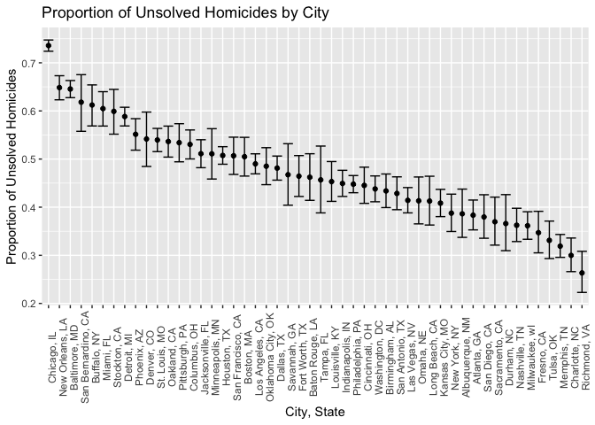
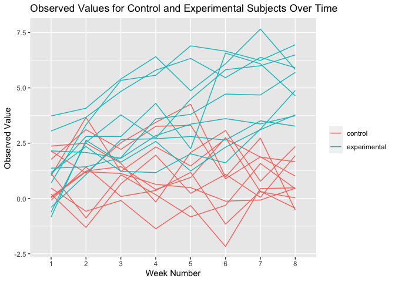
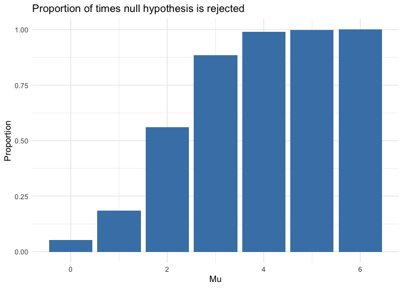
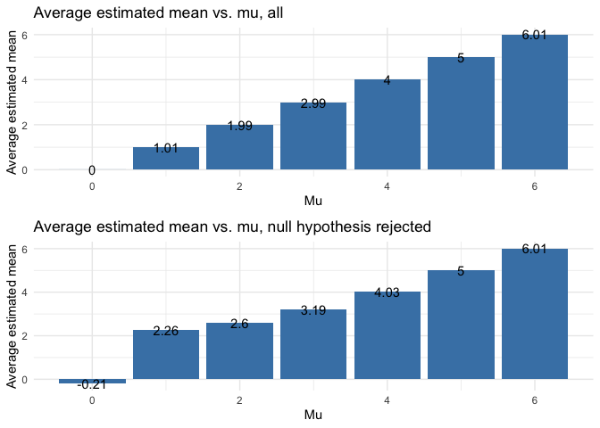

p8105\_hw5\_jp3665
================
Joana Petrescu
11/18/2020

``` r
library(tidyverse)
#install.packages("rvest")
library(rvest)
library(httr)
library(magrittr)
#insstall.packages("gridExtra")
library(gridExtra)
```

## Washington Post homicide data

This data gathered by the Washington Post contains information about the
victim, location, and disposition of over 52,000 homicides that occurred
over the past decade in 50 of the largest cities in the U.S.

### Clean Washington Post homicide data

Make data frame of total and unsolved homicides in each city.

``` r
homicide_data <- read.csv("https://raw.githubusercontent.com/washingtonpost/data-homicides/master/homicide-data.csv")

homicide_data <- homicide_data %>%
  mutate(.keep = "all", city_state = paste(city, state, sep = ", "))

head(homicide_data)
```

    ##          uid reported_date victim_last victim_first victim_race victim_age
    ## 1 Alb-000001      20100504      GARCIA         JUAN    Hispanic         78
    ## 2 Alb-000002      20100216     MONTOYA      CAMERON    Hispanic         17
    ## 3 Alb-000003      20100601 SATTERFIELD      VIVIANA       White         15
    ## 4 Alb-000004      20100101    MENDIOLA       CARLOS    Hispanic         32
    ## 5 Alb-000005      20100102        MULA       VIVIAN       White         72
    ## 6 Alb-000006      20100126        BOOK    GERALDINE       White         91
    ##   victim_sex        city state      lat       lon           disposition
    ## 1       Male Albuquerque    NM 35.09579 -106.5386 Closed without arrest
    ## 2       Male Albuquerque    NM 35.05681 -106.7153      Closed by arrest
    ## 3     Female Albuquerque    NM 35.08609 -106.6956 Closed without arrest
    ## 4       Male Albuquerque    NM 35.07849 -106.5561      Closed by arrest
    ## 5     Female Albuquerque    NM 35.13036 -106.5810 Closed without arrest
    ## 6     Female Albuquerque    NM 35.15111 -106.5378        Open/No arrest
    ##        city_state
    ## 1 Albuquerque, NM
    ## 2 Albuquerque, NM
    ## 3 Albuquerque, NM
    ## 4 Albuquerque, NM
    ## 5 Albuquerque, NM
    ## 6 Albuquerque, NM

``` r
homicide_total <- homicide_data %>%
  group_by(city_state) %>%
  summarize(n_homicides = n())
```

    ## `summarise()` ungrouping output (override with `.groups` argument)

``` r
homicide_unsolved <- homicide_data %>%
  filter(disposition != "Closed by arrest") %>%
  group_by(city_state) %>%
  summarize(n_unsolved = n())
```

    ## `summarise()` ungrouping output (override with `.groups` argument)

``` r
homicide_summary <- merge(homicide_total, homicide_unsolved, by = "city_state", all = TRUE) %>% na.omit

homicide_summary
```

    ##            city_state n_homicides n_unsolved
    ## 1     Albuquerque, NM         378        146
    ## 2         Atlanta, GA         973        373
    ## 3       Baltimore, MD        2827       1825
    ## 4     Baton Rouge, LA         424        196
    ## 5      Birmingham, AL         800        347
    ## 6          Boston, MA         614        310
    ## 7         Buffalo, NY         521        319
    ## 8       Charlotte, NC         687        206
    ## 9         Chicago, IL        5535       4073
    ## 10     Cincinnati, OH         694        309
    ## 11       Columbus, OH        1084        575
    ## 12         Dallas, TX        1567        754
    ## 13         Denver, CO         312        169
    ## 14        Detroit, MI        2519       1482
    ## 15         Durham, NC         276        101
    ## 16     Fort Worth, TX         549        255
    ## 17         Fresno, CA         487        169
    ## 18        Houston, TX        2942       1493
    ## 19   Indianapolis, IN        1322        594
    ## 20   Jacksonville, FL        1168        597
    ## 21    Kansas City, MO        1190        486
    ## 22      Las Vegas, NV        1381        572
    ## 23     Long Beach, CA         378        156
    ## 24    Los Angeles, CA        2257       1106
    ## 25     Louisville, KY         576        261
    ## 26        Memphis, TN        1514        483
    ## 27          Miami, FL         744        450
    ## 28      Milwaukee, wI        1115        403
    ## 29    Minneapolis, MN         366        187
    ## 30      Nashville, TN         767        278
    ## 31    New Orleans, LA        1434        930
    ## 32       New York, NY         627        243
    ## 33        Oakland, CA         947        508
    ## 34  Oklahoma City, OK         672        326
    ## 35          Omaha, NE         409        169
    ## 36   Philadelphia, PA        3037       1360
    ## 37        Phoenix, AZ         914        504
    ## 38     Pittsburgh, PA         631        337
    ## 39       Richmond, VA         429        113
    ## 40     Sacramento, CA         376        139
    ## 41    San Antonio, TX         833        357
    ## 42 San Bernardino, CA         275        170
    ## 43      San Diego, CA         461        175
    ## 44  San Francisco, CA         663        336
    ## 45       Savannah, GA         246        115
    ## 46      St. Louis, MO        1677        905
    ## 47       Stockton, CA         444        266
    ## 48          Tampa, FL         208         95
    ## 50          Tulsa, OK         583        193
    ## 51     Washington, DC        1345        589

### Proportion of homicides that are unsolved test case

Estimate proportion of unsolved homicides for Baltimore, MD as a test
case.

``` r
baltimore_homicide <- homicide_summary %>%
  filter(city_state == "Baltimore, MD") 

baltimore_test <- prop.test(baltimore_homicide$n_unsolved, baltimore_homicide$n_homicides) %>%
  broom::tidy() %>%
  select(estimate, conf.low, conf.high)

baltimore_test
```

    ## # A tibble: 1 x 3
    ##   estimate conf.low conf.high
    ##      <dbl>    <dbl>     <dbl>
    ## 1    0.646    0.628     0.663

### Iterate over every city in Washington Post data

Estimate proportion of unsolved homicides for each city in Washington
Post homicide data set.

``` r
homicide_input <- homicide_summary %>% remove_rownames() %>% column_to_rownames(var="city_state")

homicide_test <- map2(homicide_input$n_unsolved, homicide_input$n_homicides, prop.test)

homicide_test <- map(homicide_test, broom::tidy)

homicide_test <- map_dfr(homicide_test, extract, c("estimate", "conf.low", "conf.high"))

homicide_test <- homicide_test %>% 
  mutate(city_state = homicide_summary$city_state, estimate, conf.low, conf.high) %>%
  select(city_state, estimate, conf.low, conf.high)

homicide_test
```

    ## # A tibble: 50 x 4
    ##    city_state      estimate conf.low conf.high
    ##    <chr>              <dbl>    <dbl>     <dbl>
    ##  1 Albuquerque, NM    0.386    0.337     0.438
    ##  2 Atlanta, GA        0.383    0.353     0.415
    ##  3 Baltimore, MD      0.646    0.628     0.663
    ##  4 Baton Rouge, LA    0.462    0.414     0.511
    ##  5 Birmingham, AL     0.434    0.399     0.469
    ##  6 Boston, MA         0.505    0.465     0.545
    ##  7 Buffalo, NY        0.612    0.569     0.654
    ##  8 Charlotte, NC      0.300    0.266     0.336
    ##  9 Chicago, IL        0.736    0.724     0.747
    ## 10 Cincinnati, OH     0.445    0.408     0.483
    ## # … with 40 more rows

``` r
homicide_test %>% mutate(city_state = fct_reorder(city_state, desc(estimate))) %>% ggplot(aes(x = city_state, y = estimate)) +
  geom_errorbar(aes(ymin = conf.low, ymax = conf.high)) +
  theme(axis.text.x = element_text(angle = 90)) +
  geom_point() +
  ggtitle("Proportion of Unsolved Homicides by City") +
  xlab("City, State") +
  ylab("Proportion of Unsolved Homicides")
```

<!-- -->

## Longitudinal experimental data

This data is collected from a longitudinal study with control and
experimental subjects.

### Import and tidy data

Import individual data files, combine into data frame, add sample ID and
experimental/control arm columns.

``` r
con_urls <- str_c("./data/con_0", 01:9, ".csv", sep = "")

con_df <- bind_rows(map(con_urls, read_csv), read_csv("./data/con_10.csv")) %>% mutate(subject_id = str_c("con_", row_number())) %>% mutate(arm = "control")
```

    ## Parsed with column specification:
    ## cols(
    ##   week_1 = col_double(),
    ##   week_2 = col_double(),
    ##   week_3 = col_double(),
    ##   week_4 = col_double(),
    ##   week_5 = col_double(),
    ##   week_6 = col_double(),
    ##   week_7 = col_double(),
    ##   week_8 = col_double()
    ## )
    ## Parsed with column specification:
    ## cols(
    ##   week_1 = col_double(),
    ##   week_2 = col_double(),
    ##   week_3 = col_double(),
    ##   week_4 = col_double(),
    ##   week_5 = col_double(),
    ##   week_6 = col_double(),
    ##   week_7 = col_double(),
    ##   week_8 = col_double()
    ## )
    ## Parsed with column specification:
    ## cols(
    ##   week_1 = col_double(),
    ##   week_2 = col_double(),
    ##   week_3 = col_double(),
    ##   week_4 = col_double(),
    ##   week_5 = col_double(),
    ##   week_6 = col_double(),
    ##   week_7 = col_double(),
    ##   week_8 = col_double()
    ## )
    ## Parsed with column specification:
    ## cols(
    ##   week_1 = col_double(),
    ##   week_2 = col_double(),
    ##   week_3 = col_double(),
    ##   week_4 = col_double(),
    ##   week_5 = col_double(),
    ##   week_6 = col_double(),
    ##   week_7 = col_double(),
    ##   week_8 = col_double()
    ## )
    ## Parsed with column specification:
    ## cols(
    ##   week_1 = col_double(),
    ##   week_2 = col_double(),
    ##   week_3 = col_double(),
    ##   week_4 = col_double(),
    ##   week_5 = col_double(),
    ##   week_6 = col_double(),
    ##   week_7 = col_double(),
    ##   week_8 = col_double()
    ## )
    ## Parsed with column specification:
    ## cols(
    ##   week_1 = col_double(),
    ##   week_2 = col_double(),
    ##   week_3 = col_double(),
    ##   week_4 = col_double(),
    ##   week_5 = col_double(),
    ##   week_6 = col_double(),
    ##   week_7 = col_double(),
    ##   week_8 = col_double()
    ## )
    ## Parsed with column specification:
    ## cols(
    ##   week_1 = col_double(),
    ##   week_2 = col_double(),
    ##   week_3 = col_double(),
    ##   week_4 = col_double(),
    ##   week_5 = col_double(),
    ##   week_6 = col_double(),
    ##   week_7 = col_double(),
    ##   week_8 = col_double()
    ## )
    ## Parsed with column specification:
    ## cols(
    ##   week_1 = col_double(),
    ##   week_2 = col_double(),
    ##   week_3 = col_double(),
    ##   week_4 = col_double(),
    ##   week_5 = col_double(),
    ##   week_6 = col_double(),
    ##   week_7 = col_double(),
    ##   week_8 = col_double()
    ## )
    ## Parsed with column specification:
    ## cols(
    ##   week_1 = col_double(),
    ##   week_2 = col_double(),
    ##   week_3 = col_double(),
    ##   week_4 = col_double(),
    ##   week_5 = col_double(),
    ##   week_6 = col_double(),
    ##   week_7 = col_double(),
    ##   week_8 = col_double()
    ## )
    ## Parsed with column specification:
    ## cols(
    ##   week_1 = col_double(),
    ##   week_2 = col_double(),
    ##   week_3 = col_double(),
    ##   week_4 = col_double(),
    ##   week_5 = col_double(),
    ##   week_6 = col_double(),
    ##   week_7 = col_double(),
    ##   week_8 = col_double()
    ## )

``` r
exp_urls <- str_c("./data/exp_0", 1:9, ".csv", sep = "")

exp_df <- bind_rows(map(exp_urls, read_csv), read_csv("./data/exp_10.csv")) %>% mutate(subject_id = str_c("exp_", row_number())) %>% mutate(arm = "experimental")
```

    ## Parsed with column specification:
    ## cols(
    ##   week_1 = col_double(),
    ##   week_2 = col_double(),
    ##   week_3 = col_double(),
    ##   week_4 = col_double(),
    ##   week_5 = col_double(),
    ##   week_6 = col_double(),
    ##   week_7 = col_double(),
    ##   week_8 = col_double()
    ## )
    ## Parsed with column specification:
    ## cols(
    ##   week_1 = col_double(),
    ##   week_2 = col_double(),
    ##   week_3 = col_double(),
    ##   week_4 = col_double(),
    ##   week_5 = col_double(),
    ##   week_6 = col_double(),
    ##   week_7 = col_double(),
    ##   week_8 = col_double()
    ## )
    ## Parsed with column specification:
    ## cols(
    ##   week_1 = col_double(),
    ##   week_2 = col_double(),
    ##   week_3 = col_double(),
    ##   week_4 = col_double(),
    ##   week_5 = col_double(),
    ##   week_6 = col_double(),
    ##   week_7 = col_double(),
    ##   week_8 = col_double()
    ## )
    ## Parsed with column specification:
    ## cols(
    ##   week_1 = col_double(),
    ##   week_2 = col_double(),
    ##   week_3 = col_double(),
    ##   week_4 = col_double(),
    ##   week_5 = col_double(),
    ##   week_6 = col_double(),
    ##   week_7 = col_double(),
    ##   week_8 = col_double()
    ## )
    ## Parsed with column specification:
    ## cols(
    ##   week_1 = col_double(),
    ##   week_2 = col_double(),
    ##   week_3 = col_double(),
    ##   week_4 = col_double(),
    ##   week_5 = col_double(),
    ##   week_6 = col_double(),
    ##   week_7 = col_double(),
    ##   week_8 = col_double()
    ## )
    ## Parsed with column specification:
    ## cols(
    ##   week_1 = col_double(),
    ##   week_2 = col_double(),
    ##   week_3 = col_double(),
    ##   week_4 = col_double(),
    ##   week_5 = col_double(),
    ##   week_6 = col_double(),
    ##   week_7 = col_double(),
    ##   week_8 = col_double()
    ## )
    ## Parsed with column specification:
    ## cols(
    ##   week_1 = col_double(),
    ##   week_2 = col_double(),
    ##   week_3 = col_double(),
    ##   week_4 = col_double(),
    ##   week_5 = col_double(),
    ##   week_6 = col_double(),
    ##   week_7 = col_double(),
    ##   week_8 = col_double()
    ## )
    ## Parsed with column specification:
    ## cols(
    ##   week_1 = col_double(),
    ##   week_2 = col_double(),
    ##   week_3 = col_double(),
    ##   week_4 = col_double(),
    ##   week_5 = col_double(),
    ##   week_6 = col_double(),
    ##   week_7 = col_double(),
    ##   week_8 = col_double()
    ## )
    ## Parsed with column specification:
    ## cols(
    ##   week_1 = col_double(),
    ##   week_2 = col_double(),
    ##   week_3 = col_double(),
    ##   week_4 = col_double(),
    ##   week_5 = col_double(),
    ##   week_6 = col_double(),
    ##   week_7 = col_double(),
    ##   week_8 = col_double()
    ## )
    ## Parsed with column specification:
    ## cols(
    ##   week_1 = col_double(),
    ##   week_2 = col_double(),
    ##   week_3 = col_double(),
    ##   week_4 = col_double(),
    ##   week_5 = col_double(),
    ##   week_6 = col_double(),
    ##   week_7 = col_double(),
    ##   week_8 = col_double()
    ## )

``` r
con_exp_df <- rbind(con_df, exp_df) %>% select(subject_id, arm, week_1:week_8)

colnames(con_exp_df) = c("subject_id", "arm", "1", "2", "3", "4", "5", "6", "7", "8")

con_exp_df <- con_exp_df %>% gather(key = week, value = observation, 3:10)

con_exp_df
```

    ## # A tibble: 160 x 4
    ##    subject_id arm     week  observation
    ##    <chr>      <chr>   <chr>       <dbl>
    ##  1 con_1      control 1            0.2 
    ##  2 con_2      control 1            1.13
    ##  3 con_3      control 1            1.77
    ##  4 con_4      control 1            1.04
    ##  5 con_5      control 1            0.47
    ##  6 con_6      control 1            2.37
    ##  7 con_7      control 1            0.03
    ##  8 con_8      control 1           -0.08
    ##  9 con_9      control 1            0.08
    ## 10 con_10     control 1            2.14
    ## # … with 150 more rows

### Plot observations for each subject over time

Make spaghetti plot of subject data over time.

``` r
con_exp_df %>% ggplot(aes(x = week, y = observation, group = subject_id, color = arm)) +
  geom_line() +
  ggtitle("Observed Values for Control and Experimental Subjects Over Time") +
  xlab("Week Number") +
  ylab("Observed Value") +
  theme(legend.title = element_blank())
```

<!-- -->

This plot demonstrates that the observations for subjects in the
experimental arm of the trial increase during the duration of the study
and are generally higher than the observations for subjects in the
control arm.

## Power simulation

Simulate different sample sizes and effect sizes in a one-sample t-test
in order to study statistical power.

### Generate 5000 datasets for one-sample t-test on normal distribution

Sample size = 30 Standard deviation = 5 Mean = 0

``` r
sim_function <- function(n, mu, sigma) {
  
  sim_data <-  tibble(
    x = rnorm(n, mean = mu, sd = sigma)
  )
  
  sim_data %>% 
    t.test() %>%
    broom::tidy() %>%
    select(estimate, p.value)
  
}

sim_results_zero <- rerun(5000, sim_function(30, 0, 5)) %>%
  bind_rows %>%
  mutate(mean_est = estimate, p_value = p.value, mu = 0, .keep = "none")
```

### Generate simulated datasets for different mean values

Mean = {1:6}

``` r
sim_loop = vector("list", length = 6)

for (i in 1:6) {
  
  sim_loop[[i]] <- rerun(5000, sim_function(30, i, 5)) %>%
  bind_rows %>%
  mutate(mean_est = estimate, p_value = p.value, mu = i, .keep = "none")
  
}

sim_loop <- bind_rows(sim_loop)

sim_loop <- rbind(sim_loop, sim_results_zero)
```

### Plot proportion null rejected for each mean

Plot proportion of times that the null hypothesis was rejected (p \<
0.05) for each mean

``` r
prop_reject <- sim_loop %>%
  mutate(reject = as.logical(p_value < 0.05)) %>%
  group_by(mu) %>%
  count(reject = (reject == TRUE)) %>%
  filter(reject == TRUE) %>%
  mutate(prop = n/5000)

prop_reject %>% ggplot(aes(x = mu, y = prop)) +
  geom_bar(stat = "identity", fill="steelblue") +
  theme_minimal() +
  ggtitle("Proportion of times null hypothesis is rejected") +
  xlab("Mu") +
  ylab("Proportion")
```

<!-- -->

The null hypothesis was reject more frequently with higher mu values,
approaching 100% of the time with mu = 6.

### Estimated mean vs. mu

Is the sample average of estimated mu across tests for which the null is
rejected approximately equal to the true value of mu?

``` r
p1 <- sim_loop %>%
  mutate(reject = as.logical(p_value < 0.05)) %>%
  group_by(mu) %>%
  summarize(avg_mean = mean(mean_est)) %>%
  ggplot(aes(x = mu, y = avg_mean)) +
  geom_bar(stat = "identity", fill="steelblue") +
  theme_minimal() +
  ggtitle("Average estimated mean vs. mu, all") +
  xlab("Mu") +
  ylab("Average estimated mean")+
  geom_text(aes(label = round(avg_mean, digits = 2)))
```

    ## `summarise()` ungrouping output (override with `.groups` argument)

``` r
p2 <- sim_loop %>%
  mutate(reject = as.logical(p_value < 0.05)) %>%
  group_by(mu) %>%
  filter(reject == TRUE) %>%
  summarize(avg_mean = mean(mean_est)) %>%
  ggplot(aes(x = mu, y = avg_mean)) +
  geom_bar(stat = "identity", fill="steelblue") +
  theme_minimal() +
  ggtitle("Average estimated mean vs. mu, null hypothesis rejected") +
  xlab("Mu") +
  ylab("Average estimated mean") +
  geom_text(aes(label = round(avg_mean, digits = 2)))
```

    ## `summarise()` ungrouping output (override with `.groups` argument)

``` r
grid.arrange(p1, p2, ncol = 1, nrow = 2)
```

<!-- -->

The average estimated mu across datasets for which the null hypothesis
was rejected is not approximately equal to mu because rejecting the null
hypothesis requires that the distribution be unlikely (\< 0.05) to be
drawn from a normal distribution with the given parameters (mu, standard
deviation) which, by definition, means that he average estimated mu for
datasets for which the null hypothesis was rejected will differ from the
defined mu value.
